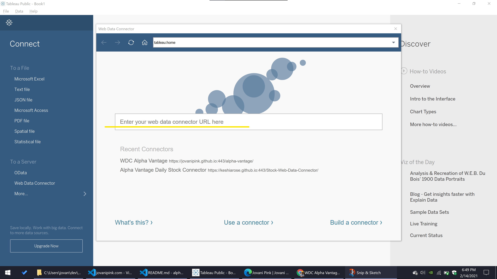
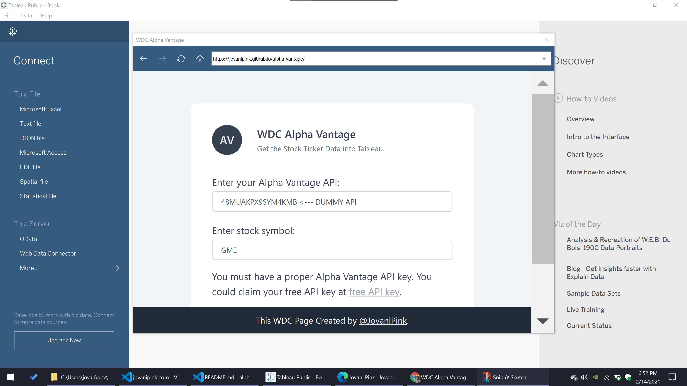

# WDC Alpha Vantage

> Tableau Web Data Connector that pulls stock data from Alpha Vantage.

## General

This is a repo using Tableau's Web Data Connector to pull in stock data from Alpha Vantage.

Alpha Vantage offers free stock APIs in JSON and CSV formats for realtime and historical equity, forex, cryptocurrency data and over 50 technical indicators. I choose to use Alpha Vantage's API service: https://www.alphavantage.co/ with an example focusing the on the time series weekly data of GameStop (GME) https://www.alphavantage.co/documentation/#weekly

You must have a proper Alpha Vantage API key. You could claim your free API key at <a target="_blank" rel="noopener noreferrer" href="https://www.alphavantage.co/support/#api-key">free API key</a>. Now you have access to making calls to get your data right away. Here’s the link to their <a target="_blank" rel="noopener noreferrer" href="https://www.alphavantage.co/documentation/">documentation</a>.

### Web Data Connector (WDC)

"Create a Web Data Connector (WDC) when you want to connect to a web data source from Tableau. A WDC is an HTML page with JavaScript code that connects to web data (for example, by means of a REST API), converts the data to a JSON format, and passes the data to Tableau." -[Get Started (WDC)](https://tableau.github.io/webdataconnector/docs/)

## How to use

This guide is how to use WDC Alpha Vantage in <a target="_blank" rel="noopener noreferrer" href="https://www.tableau.com/products/desktop">Tableau Desktop</a>.

Requirements:

- Tableau
- Alpha Vantage API
- Correct Stock Ticker

Following steps:

1. After Opening Tableau Desktop, on the start page, within the Connect pane to the left, click Web Data Connector under the 'To a Server' subheading.


2. Enter the WDC Alpha Vantage URL [https://jovanipink.github.io/alpha-vantage/] and press Enter.



3. Tableau loads the WDC Alpha Vantage page then you will enter your secure API KEY and ticker in all caps.



4. Scroll and click on the button "Get Stock Data!" I haven't completed the form validation code so you will have to manually enter the correct API and ticker.

5. Tableau calls your WDC Alpha Vantage page JavaScript code, downloads data, and displays it in the Data Source pane after clicking on Update Now.

The return data takes on this shape:

```javascript
const columns = [
  {
    id: "date",
    dataType: tableau.dataTypeEnum.date,
  },
  {
    id: "open",
    dataType: tableau.dataTypeEnum.float,
  },
  {
    id: "high",
    dataType: tableau.dataTypeEnum.float,
  },
  {
    id: "low",
    dataType: tableau.dataTypeEnum.float,
  },
  {
    id: "close",
    dataType: tableau.dataTypeEnum.float,
  },
  {
    id: "volume",
    dataType: tableau.dataTypeEnum.int,
  },
];
```

## Example

Here is a quick example use of grabbing GameStop weekly stocks from the beginning of 2021 and heatmap of the closing weekly price.

https://public.tableau.com/profile/jovanipink#!/vizhome/WDCAlphaVantage/AvgClosed2021

## 📝 Todo Checklist

A helpful checklist to gauge how your README is coming on what I would like to finish:

- [ ] Add Daily API call.
- [ ] Remove jQuery deps
- [ ] Update to ES6
- [ ] Make template folder based off of Parcel, Typescript, and Tailwindcss

## 🤝 Contributing

Pull requests are welcome. For major changes, please open an issue first to discuss what you would like to change.

Please make sure to update tests as appropriate.

1. Fork this repository;
2. Create your branch: `git checkout -b my-new-feature`;
3. Commit your changes: `git commit -m 'Add some feature'`;
4. Push to the branch: `git push origin my-new-feature`.

**After your pull request is merged**, you can safely delete your branch.

## 📝 License

This project is licensed under the MIT License - see the [LICENSE.md](LICENSE.md) file for more information.
